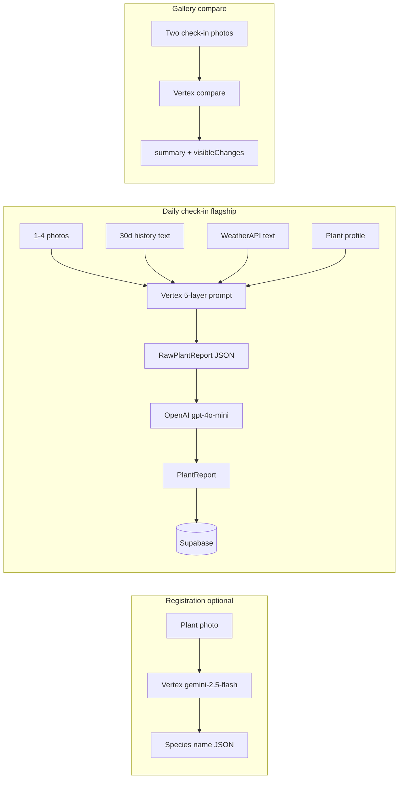

# Twinly

**Give your plant its own digital twin.**

Responsive web app: Next.js 15 · Tailwind · shadcn/ui · Supabase (remote) · Gemini · WeatherAPI.

## Prerequisites

- **Node.js 20+** (see `.nvmrc`)
- Supabase project: `cyvoxtijyntxixeyghnm`
- Team uses the **remote** database only (no local Supabase stack)

## Quick start

1. **Install dependencies**

   ```bash
   npm install
   ```

2. **Environment**

   Copy `.env.example` → `.env.local` and fill in keys from [Supabase Dashboard](https://supabase.com/dashboard/project/cyvoxtijyntxixeyghnm/settings/api):

   - `NEXT_PUBLIC_SUPABASE_URL`
   - `NEXT_PUBLIC_SUPABASE_ANON_KEY` (publishable / anon)
   - `SUPABASE_SERVICE_ROLE_KEY` (secret — server only)

3. **Vertex AI Gemini (GCP credits)**

   Twinly uses **Vertex AI**, not the AI Studio API key free tier.

   In `.env.local`:

   ```env
   GOOGLE_CLOUD_PROJECT=your-gcp-project-id
   GOOGLE_CLOUD_LOCATION=us-central1
   GOOGLE_SERVICE_ACCOUNT_JSON={"type":"service_account",...}
   ```

   Put the **entire** service account JSON on **one line** (best for Vercel/deploy):

   ```bash
   jq -c . secrets/gcp-service-account.json
   # Paste output as GOOGLE_SERVICE_ACCOUNT_JSON=...
   ```

   One-time GCP setup:

   1. [Enable billing](https://console.cloud.google.com/billing) on the project that has your credits.
   2. [Enable Vertex AI API](https://console.cloud.google.com/apis/library/aiplatform.googleapis.com).
   3. Create a service account with **Vertex AI User** role and download JSON into `secrets/` (gitignored).
   4. Do not use `GEMINI_API_KEY` from [AI Studio](https://aistudio.google.com) — that hits free-tier quotas.

4. **Supabase MCP (Cursor)**

   This repo pins MCP to the Twinly project in [`.cursor/mcp.json`](.cursor/mcp.json).

   - Open **Cursor Settings → MCP** and ensure the Supabase server is connected (OAuth on first use).
   - Reload the window after cloning so workspace MCP picks up `project_ref=cyvoxtijyntxixeyghnm`.

   Apply the initial schema (once per project):

   - Ask the agent to run `apply_migration` with `supabase/migrations/20260516000000_initial_schema.sql`, or
   - Paste that file into the Supabase SQL editor.

5. **Run dev server**

   ```bash
   npm run dev
   ```

   Open [http://localhost:3000](http://localhost:3000).

## Project structure

```
src/
  app/                 # App Router routes (skeleton placeholders)
  components/          # UI + layout
  lib/supabase/        # Browser, server, admin, middleware clients
  services/
    geminiService/     # Vertex AI Gemini (GCP)
    weatherService/    # WeatherAPI (feature milestones)
  types/               # Database + PlantReport types
supabase/migrations/   # SQL migrations (source of truth for remote DB)
.cursor/mcp.json       # Supabase MCP → remote project
```

## Routes (skeleton)

| Route | Purpose |
|-------|---------|
| `/` | Landing |
| `/auth` | Sign in / sign up |
| `/dashboard` | All plants |
| `/plants/new` | Register plant |
| `/plants/[id]` | Plant detail |
| `/plants/[id]/checkin` | Check-in flow |
| `/scan/[id]` | QR → redirects to check-in |
| `/api/register-plant` | Gemini registration auto-fill |
| `/api/analyze` | Check-in analysis |
| `/api/compare-photos` | Vertex before/after photo compare |
| `/api/weather` | Weather proxy |
| `/dashboard` | Garden health + weather |
| `/settings` | Location city for weather |

## Scripts

| Command | Description |
|---------|-------------|
| `npm run dev` | Dev server (Turbopack) |
| `npm run build` | Production build |
| `npm run lint` | ESLint |

## Database

Remote Postgres tables: `users`, `plants`, `checkins`, `analysis_results`, `interventions`.

Storage bucket: `plant-photos` (public).

Regenerate TypeScript types after schema changes (via Supabase MCP `generate_typescript_types`).

## Architecture (for judges)

Twinly’s **digital twin memory** runs on **Gemini 2.5 Flash via Vertex AI** (GCP project + service account). **OpenAI (gpt-4o-mini)** only polishes Gemini’s structured output into gardener-friendly copy—it never receives images.



| Capability | Engine | Route / entry |
|------------|--------|----------------|
| Species suggest (registration) | Vertex | `POST /api/register-plant` |
| Check-in analysis (5 layers) | Vertex → OpenAI | `POST /api/analyze` |
| Photo before/after compare | Vertex only | `POST /api/compare-photos` |
| Live 7-day forecast | WeatherAPI | Dashboard + plant Predictions tab |
| Weather at check-in | WeatherAPI snapshot | `checkins.weather_snapshot` |

**Key files:** `src/services/geminiService/`, `src/app/api/analyze/route.ts`, `src/app/api/compare-photos/route.ts`

**Demo script:** see [DEMO.md](./DEMO.md) for a 2-minute walkthrough to record for submission.
